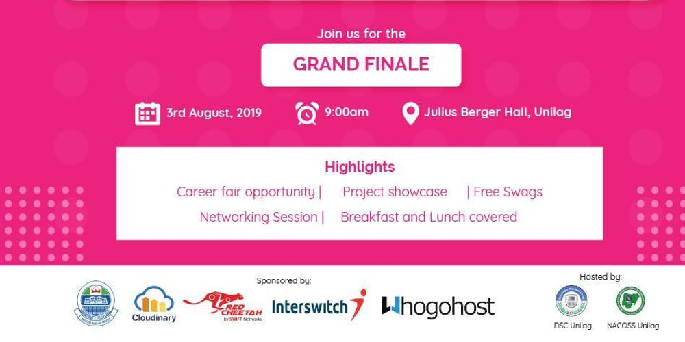

# Welcome to the Official OpenHack Week Guide!

## About the event

**OHW is a week-long hackathon aimed at building actual solutions to solve different organizational problems. Real life problems are enlisted by different organizations such as, NGOs, Start-ups, Tech companies etc. Participants are a team of 3-5 persons, each team is allocated a problem at random and is to work collaboratively in providing a suitable solution to the allocated problem.**

## [**Create a Free Cloudinary Account**](https://cloudinary.com/users/register/free)



### Check out some cool tutorials on cool examples of how to utilize Cloudinary in YOUR hack!

## Grand Finale

**On the final day, participants who successfully completed the challenge will pitch and showcase their solutions to the sponsors. A career fair will also be held to help developers get internship/hiring opportunities at amazing companies. This will also help organizations to scout talents first-hand.**

